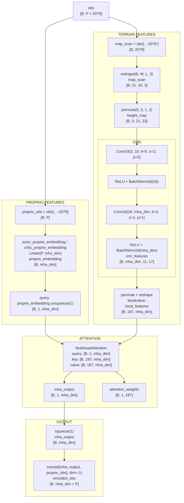
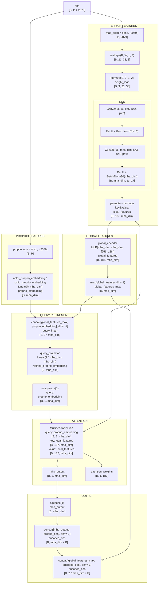

## actor_critic_encoder pipline
```
AME1
INPUT
obs
shape: [B , P + 33 * 21 * 3] = [B, P + 2079]
B = batch size
P = proprio_obs dimension
map_scan_dim = (L, W, 3) = (33, 21, 3)
2079 = 33 * 21 * 3 flattened terrain scan size
187 = 11 * 17 terrain token count after CNN downsampling
mha_dim = 64 MHA feature dimension


TERRAIN FEATURES
obs
[B, P + 2079]
  |
  |  map_scan = obs[:, -2079:]
  v
map_scan
[B, 2079]
  |
  |  map_scan.reshape(B, W, L, 3)
  v
map_scan
[B, 21, 33, 3]
  |
  |  height_map = map_scan.permute(0, 3, 1, 2)
  v
height_map
[B, 3, 21, 33]
  |
  |  cnn_features = self.map_cnn(height_map)
  |    Conv2d(3, 16, k=5, s=2, p=2)
  |    ReLU
  |    BatchNorm2d(16)
  |    Conv2d(16, mha_dim, k=3, s=1, p=1)
  |    ReLU
  |    BatchNorm2d(mha_dim)
  v
cnn_features
[B, mha_dim, 11, 17]
  |
  |  cnn_features.permute(...).reshape(B, 11*17, mha_dim)
  v
local_features
[B, 187, mha_dim]


PROPRIO FEATURES
obs
[B, P + 2079]
  |
  |  proprio_obs = obs[:, :-2079]
  v
proprio_obs
[B, P]
  |
  |  actor_proprio_embedding(proprio_obs): Linear(P_actor, mha_dim)
  |  critic_proprio_embedding(proprio_obs): Linear(P_critic, mha_dim)
  v
proprio_embedding
[B, mha_dim]
  |
  |  proprio_embedding.unsqueeze(1)
  v
proprio_embedding
[B, 1, mha_dim]


ATTENTION
query = proprio_embedding
[B, 1, mha_dim]
key = local_features
[B, 187, mha_dim]
value = local_features
[B, 187, mha_dim]
  |
  |  mha_output, attention_weights = self.mha(query, key, value) = nn.MultiheadAttention()
  v
mha_output
[B, 1, mha_dim]
attention_weights
[B, 1, 187]


OUTPUT
mha_output
[B, 1, mha_dim]
  |
  |  mha_output.squeeze(1)
  v
mha_output
[B, mha_dim]
  |
  |  encoded_obs = cat([mha_output, proprio_obs], dim=-1)
  v
encoded_obs
[B, mha_dim + P]
```

AME2 (`attach_global=True`) differs from AME1 in two places:
1. It adds a global-context branch on top of `local_features`.
2. It uses that global feature both to refine the MHA query and to extend the final `encoded_obs`.

```
AME2 (attach_global=True)
INPUT
obs
shape: [B , P + 33 * 21 * 3] = [B, P + 2079]
B = batch size
P = proprio_obs dim
map_scan_dim = (L, W, 3) = (33, 21, 3)
mha_dim = 64 MHA feature dimension
2079 = 33 * 21 * 3 flattened terrain scan size
187 = 11 * 17 terrain token count after CNN downsampling


TERRAIN FEATURES
obs
[B, P + 2079]
  |
  |  map_scan = obs[:, -2079:]
  v
map_scan
[B, 2079]
  |
  |  map_scan.reshape(B, W, L, 3)
  v
map_scan
[B, 21, 33, 3]
  |
  |  height_map = map_scan.permute(0, 3, 1, 2)
  v
height_map
[B, 3, 21, 33]
  |
  |  cnn_features = self.map_cnn(height_map)
  |    Conv2d(3, 16, k=5, s=2, p=2)
  |    ReLU
  |    BatchNorm2d(16)
  |    Conv2d(16, mha_dim, k=3, s=1, p=1)
  |    ReLU
  |    BatchNorm2d(mha_dim)
  v
cnn_features
[B, mha_dim, 11, 17]
  |
  |  cnn_features.permute(...).reshape(B, 11*17, mha_dim)
  v
local_features
[B, 187, mha_dim]


PROPRIO FEATURES
obs
[B, P + 2079]
  |
  |  proprio_obs = obs[:, :-2079]
  v
proprio_obs
[B, P]
  |
  |  actor_proprio_embedding(proprio_obs): Linear(P_actor, mha_dim)
  |  critic_proprio_embedding(proprio_obs): Linear(P_critic, mha_dim)
  v
proprio_embedding
[B, mha_dim]


GLOBAL FEATURES
local_features
[B, 187, mha_dim]
  |
  |  global_encoder = MLP(mha_dim, mha_dim, [256, 128])
  v
global_features
[B, 187, mha_dim]
  |
  |  global_features_max = max(global_features, dim=1)
  v
global_features_max
[B, mha_dim]


QUERY REFINEMENT
global_features_max
[B, mha_dim]
proprio_embedding
[B, mha_dim]
  |
  |  cat([global_features_max, proprio_embedding], dim=-1)
  v
query_input
[B, 2 * mha_dim]
  |
  |  query_projector: Linear(2 * mha_dim, mha_dim)
  v
proprio_embedding
[B, mha_dim]
  |
  |  unsqueeze(1)
  v
proprio_embedding
[B, 1, mha_dim]


ATTENTION
query = proprio_embedding
[B, 1, mha_dim]
key = local_features
[B, 187, mha_dim]
value = local_features
[B, 187, mha_dim]
  |
  |  mha_output, attention_weights = self.mha(query, key, value)
  v
mha_output
[B, 1, mha_dim]
attention_weights
[B, 1, 187]


OUTPUT
mha_output
[B, 1, mha_dim]
  |
  |  squeeze(1)
  v
mha_output
[B, mha_dim]
  |
  |  encoded_obs = cat([mha_output, proprio_obs], dim=-1)
  v
encoded_obs
[B, mha_dim + P]
  |
  |  encoded_obs = cat([global_features_max, encoded_obs], dim=-1)
  v
encoded_obs
[B, mha_dim + mha_dim + P] = [B, 2 * mha_dim + P]
```

## Mermaid Version

### Notation

- `B`: batch size
- `P`: proprioceptive observation dimension
- `map_scan_dim`: (L, W, 3) = (33, 21, 3)
`2079 = 33 * 21 * 3`: flattened terrain scan size
`33 * 21`: terrain scan grid size `(L, W)`
`3`: local point coordinates `(x, y, z)` for each scan point
- `187 = 11 * 17`: terrain token count after CNN downsampling
- `mha_dim = 64`: MHA feature dimension

### AME1



### AME2 (`attach_global=True`)


